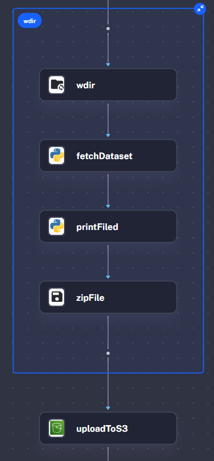
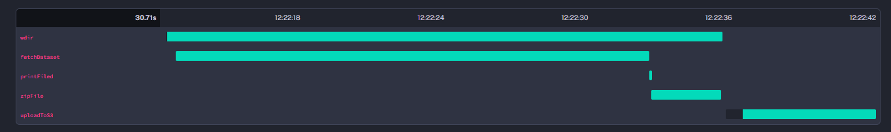
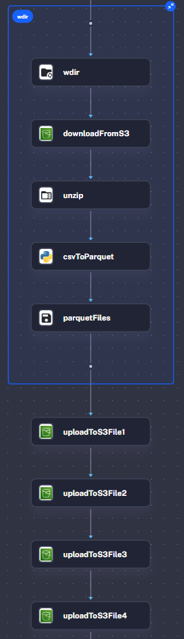
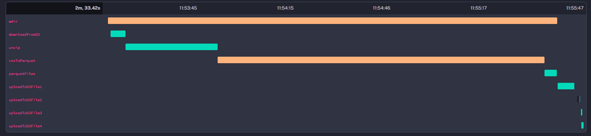
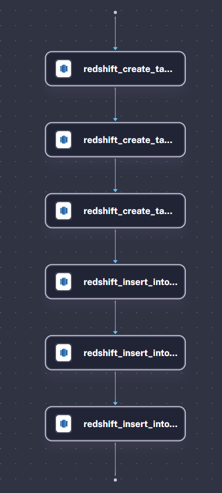
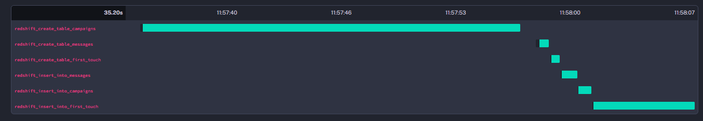
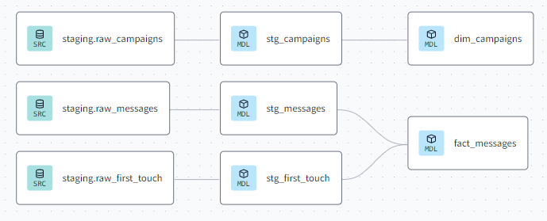
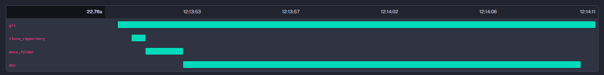
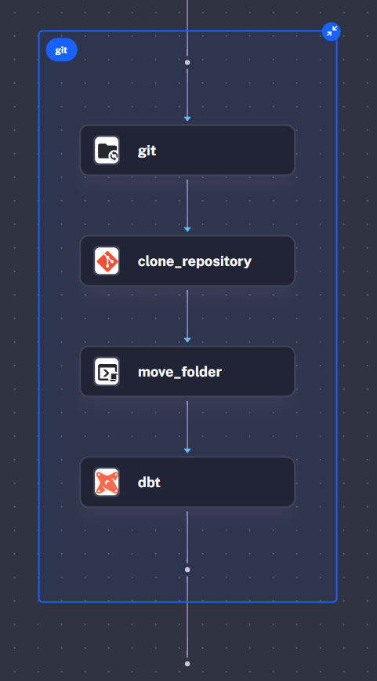
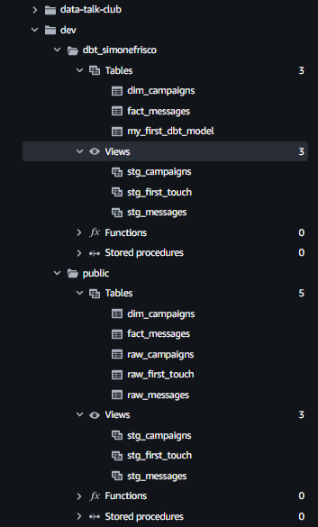

# Retail Marketing Campaigns (Data Engineering Zoomcamp Project)



> This is not the final submission of the project, after the submission I updated the readme with more details on the complete ETL process and revised the code

# Dataset

This dataset contains multi-channel messages of medium sized online store for 2 years.

Channels: email, web push, mobile push, SMS.

Campaign types: bulk, triggers, transactional.

Notice: this dataset contains messages-demo.csv file limited to 10M messages. I use this dataset due the fact that is avaible trou Kaggle API. The original dataset contains more than 700M messages.

- **campaigns.csv**
All messages are related to some kind of campaigns:

1. Bulk campaigns are sent for sale outs and before holidays to stimulate sales and bring back customers.
2. Trigger messages (like abandoned cart) are sent automatically based on user's behavior. More users visited website/app – more trigger messages are sent.
3. Transactional messages are used for some kind of information delivery process: bonuses added, order delivery status changed, etc.

- **messages.csv**
Messages table contains a list of all messages sent with its statuses and meta info:

1. Campaign
2. Channel
3. Type
4. Opened (when)
5. Clicked (when)
6. Purchase

- **client_first_purchase_date.csv**
The file has 2 columns:
1. Client ID
2. Date of the first purchase ever

## Note:

Despite the fact that the project is not focused on building a complex data pipeline, I put more effort into delving deeper:
- Setup of all necessary infrastructure
- Kestra ETL 
- Studying and getting my hands dirty with new technologies such as AWS Redshift, EC2, Docker Compose and Dbt

# 1) Technologies

- **Cloud:** AWS
- **Infrastructure as code (IaC):** Terraform
- **Workflow orchestration**: Kestra
- **Data Warehouse:** Redshift
- **Batch processing:** Dbt

# 2) Infrastructure Deployment 

- **[./aws-ec2-terraform](https://github.com/simonefrisco/data-engineering-zoomcamp-final-project/tree/main/aws-ec2-terraform)**

terraform : https://github.com/kestra-io/terraform-deployments/tree/main/aws-ec2

manual : https://kestra.io/docs/installation/aws-ec2


Requirements:
- AWS CLI installed with proper user configure 
- Clone this repo and open the terminal

# 3) Setup EC2 Kestra Istance

- **[./aws-ec2-config](https://github.com/simonefrisco/data-engineering-zoomcamp-final-project/tree/main/aws-ec2-config)**


Requirements:
- AWS CLI installed with proper user configure 
- Kaggle Account
- Redshift Cluster

# 4) Run Flows

```
sudo docker-compose up -d
```
- Go to the public IP address of the EC2 instance in a browser (make sure to use http and not https)
- add :8080 to your public IP
- It should load the Kestra UI with the login form : 

## 4.1 Initialize Prod Namespace

In order to sync the namespace files with our repo, the simplest way is using [git.Sync](https://kestra.io/plugins/plugin-git/tasks/io.kestra.plugin.git.sync)

- Navigate to your public IP address 
- Insert username and password
- Create your first Kestra Flow in the UI editor -> Create Flow -> Save -> Execute :
    - Insert username and password that you setup in step 3.3

- Click on "Create"


- Copy/Paste the following snippet in order to import all Flow definition from **[./kestra_prod](https://github.com/simonefrisco/data-engineering-zoomcamp-final-project/tree/main/kestra_prod)** to the Kestra Istance

```yaml
id: sync_from_git
namespace: prod

tasks:
  - id: git
    type: io.kestra.plugin.git.Sync
    url: https://github.com/simonefrisco/data-engineering-zoomcamp-final-project
    branch: main
    gitDirectory: kestra_prod # optional, otherwise all files
    namespaceFilesDirectory: prod # optional, otherwise the namespace root directory
    dryRun: false  # if true, print the output of what files will be added/modified or deleted without overwriting the files yet

triggers:
  - id: every_day
    type: io.kestra.core.models.triggers.types.Schedule
    cron: "0 0 */1 * *"
```

## 4.2 Run 

- **[./kestra_prod](https://github.com/simonefrisco/data-engineering-zoomcamp-final-project/tree/main/kestra_prod)**

The folder contains all Flow definitions (in YAML format) and Python scripts that will be executed by the flows.


### Flow 0

> Download Data

- Fetch .zip file with Kaggle API
- Upload the file in S3 bucket
<!-- 

 -->

<div style="display: flex; align-items: center; justify-content: center;">
  
  
</div>

### Flow 1

> Data Raw to Datalake


- Download zip from S3 bucket
- Extract CSV file
- Convert CSV to Parquet with Polars
- Upload parquet files to S3

<!-- 
 -->

<div style="display: flex; align-items: center; justify-content: center;">
  
  
</div>

### Flow 2

> Datalake to Data Warehouse


- Create 3 empty Redshift tables: Messages, Campaigns, First Purchase
- Upload data from parquet files into Redshift tables with COPY command

<!-- 
 -->
<div style="display: flex; align-items: center; justify-content: center;">
  
  
</div>

### Flow 3
> Dbt Project 

<!-- 
 -->
<div style="display: flex; align-items: center; justify-content: center;">
  
</div>

- Clone current repo
- Move **[./dbt-project](https://github.com/simonefrisco/data-engineering-zoomcamp-final-project/tree/main/dbt-project)** to the root
- Run `dbt init` and `dbt build`

<!--  -->
<div style="display: flex; align-items: center; justify-content: center;">
  
  
</div>

# 5) Datawarehouse

- Final database structure of the Redshift data warehouse with staging, analiytics schemas:


6) Dashboard

TBD