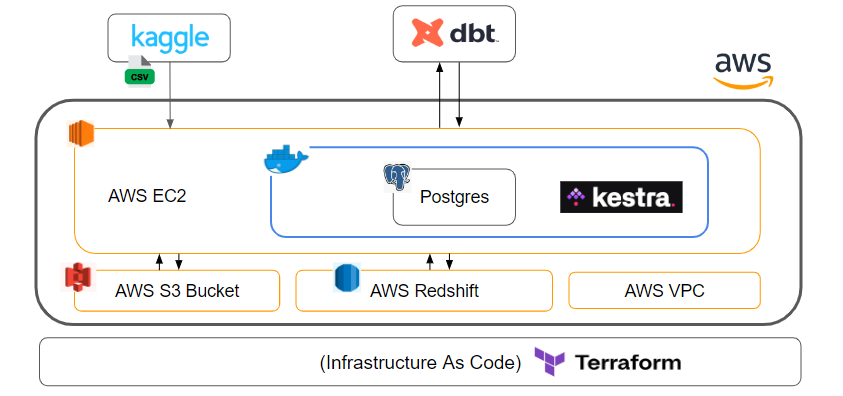

# Retail Marketing Campaigns

# Dataset


# 1) Technologies

- **Cloud:** AWS
- **Infrastructure as code (IaC):** Terraform
- **Workflow orchestration**: Kestra
- **Data Warehouse:** Redshift
- **Batch processing:** Dbt

# 2) Infrastructure Deployment 

- **[./aws-ec2-terraform](https://github.com/simonefrisco/data-engineering-zoomcamp-final-project/tree/main/aws-ec2-terraform)**

terraform : https://github.com/kestra-io/terraform-deployments/tree/main/aws-ec2

manual : https://kestra.io/docs/installation/aws-ec2


Requirements:
- AWS CLI installed with proper user configure 
- Clone this repo and open the terminal

# 3) Setup EC2 Kestra Istance

- **[./aws-ec2-config](https://github.com/simonefrisco/data-engineering-zoomcamp-final-project/tree/main/aws-ec2-config)**


Requirements:
- AWS CLI installed with proper user configure 
- Kaggle Account
- Redshift Cluster

# 4) Run Kestra

```
sudo docker-compose up -d
```


## 4.1 Initialize Prod Namespace

In order to sync the namespace files with our repo, the simplest way is using [git.Sync](https://kestra.io/plugins/plugin-git/tasks/io.kestra.plugin.git.sync)

- Navigate to your public IP address 
- Insert username and password
- Create your first Kestra Flow in the UI editor -> Create Flow -> Save -> Execute :

```yaml
id: sync_from_git
namespace: prod

tasks:
  - id: git
    type: io.kestra.plugin.git.Sync
    url: https://github.com/simonefrisco/data-engineering-zoomcamp-final-project
    branch: main
    gitDirectory: kestra_prod # optional, otherwise all files
    namespaceFilesDirectory: prod # optional, otherwise the namespace root directory
    dryRun: true  # if true, print the output of what files will be added/modified or deleted without overwriting the files yet

triggers:
  - id: every_day
    type: io.kestra.core.models.triggers.types.Schedule
    cron: "0 0 */1 * *"
```

## 4.2 Run 

### Flow 0
- Fetch .zip file with Kaggle API
- Upload the file in S3 bucket



### Flow 1

- Download zip from S3 bucket
- Extract CSV file
- Convert CSV to Parquet with Polars
- Upload parquet files to S3


### Flow 2

- Create 3 empty Redshift tables: Messages, Campaigns, First Purchase
- Upload data from parquet files into Redshift tables with COPY command


### Flow 3

- Clone current repo
- Move **[./dbt-project](https://github.com/simonefrisco/data-engineering-zoomcamp-final-project/tree/main/dbt-project)** to the root
- Run `dbt init` and `dbt build`

