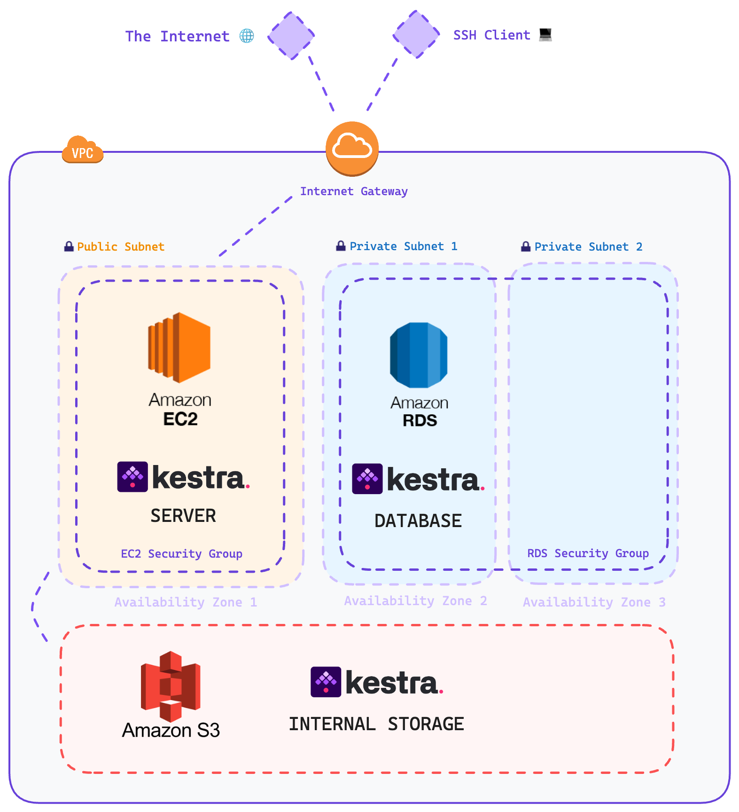

# Intro

## 2.1  Clone official template
I created a terraform project folder starting from the official template:

> credit : https://github.com/kestra-io/terraform-deployments/tree/main/aws-ec2

```
git clone https://github.com/kestra-io/terraform-deployments/
move .\terraform-deployments\aws-ec2 .\aws-ec2
rmdir /s /q .\terraform-deployments
```
At this point, following the readme istructions you have to :
1) create a secrets.tfvars file with the following variables:
```
db_username= "xxxx"
db_password= "xxxx"
my_ip= "xxxx"
aws_access_key= "xxxx"
aws_secret_key= "xxxx"
```
2) create the key piar
3) initialize the terraform directory and apply the config

! Attention, make sure to change the ami-xxxxxxx value based on your aws region

Sadly, I was able to deploy almost all resources tranne the webserver.

I think that the problem was in some of the docker configuration so I decided to deploy the webserver partially manually.

At the **[./aws-ec2](https://github.com/simonefrisco/data-engineering-zoomcamp-final-project/tree/main/aws-ec2-config)** folder you can find a modified version of original template, the main differences are:
- auto generate ssh key
- same aws_istance resource without provisioner and user_data
- no dedicated rds istance


## 2.2 Deploy terraform project

> Note: the current version of this configuration assumes that you already have an IAM user roles with the corresponding policies to provisione AWS resources.

```
set AWS_PROFILE=your-aws-cli-profile
terraform init
terraform apply -var-file="secrets.tfvars"
```

### Output of the Terraform Apply

```
Outputs:
web_public_dns = "ec2-XX-XXX-XXX-XXX.eu-south-1.compute.amazonaws.com"
web_public_ip = "XXX.XXX.XXX.XXX"
```

## 2.3 Destroy Terraform Resources
When you want:
```
terraform destroy -var-file="secrets.tfvars"
```

# Deploy Kestra on AWS

This repository contains Terraform files to deploy Kestra on AWS with the following components:
* **AWS EC2**: to host Kestra server
* **RDS Postgres**: the Kestra database backend
* **AWS S3**: the Kestra internal storage




## Running the Configuration

> Note: the current version of this configuration assumes that you already have an IAM user roles with the corresponding policies to provisione AWS resources.

### Create the Secrets file
Create a secrets file called `secrets.tfvars` and populate it with the follow secrets:

`db_username`: this is going to be the master user for RDS

`db_password`: this is going to be the RDS master user's password

`my_ip`: this is going to be your public IP

`aws_access_key`: AWS Access Key

`aws_secret_key`: AWS Secret Key

> Note: If you already havea a configured AWS CLI you can remove the `aws_access_key` and `aws_secret_key` from the `main.tf` and `variables.tf`

### Create the Key Pair

To authenticate to your EC2 instance easily and provisione the script initiation you need to create a key pair - allowing a SSH tunel connection:

`ssh-keygen -t rsa -b 4096 -m pem -f kestra_kp && openssl rsa -in kestra_kp -outform pem && chmod 400 kestra_kp.pem`

> Note: depending of your system, the key might be named `kestra_kp` (without the `.pem` extension). You can use `mv kestra_kp kestra_kp.pem` to solve this issue.

### Initializing the Terraform directory

Run the command: `terraform init`

### Apply the Terraform Config to AWS

Run the command: `terraform apply -var-file="secrets.tfvars"`

> To connect through SSH to your EC2 instance: `ssh -i "kestra_key.pem" ubuntu@$(terraform output -raw web_public_dns)`

### To destroy everything that was created by the Terraform Config

Run the command: `terraform destroy -var-file="secrets.tfvars"`

> Note: when destroying resources, the database will be snapshotted